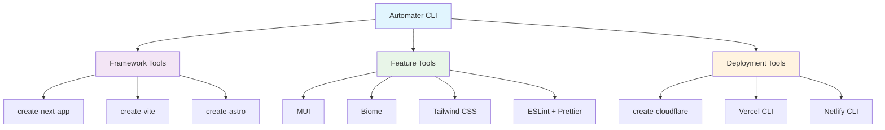
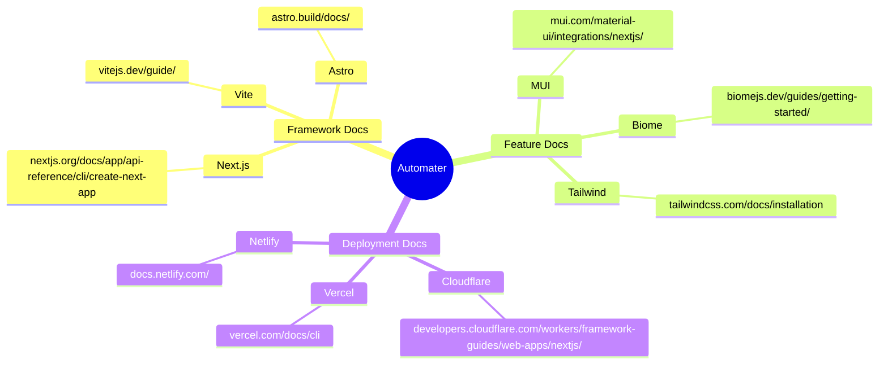
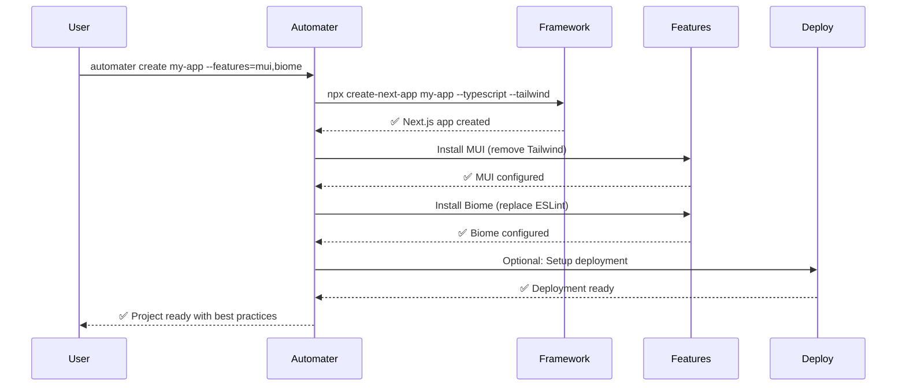
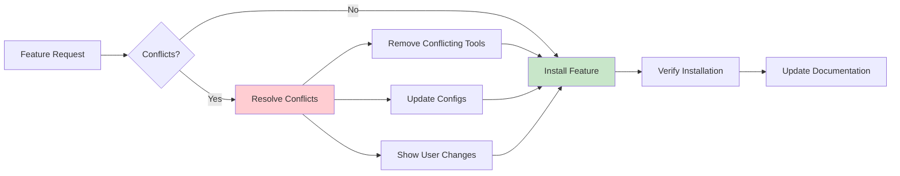

# Automater Architecture

## Wrapper Hierarchy

```mermaid
graph TD
    A[Automater CLI] --> B[Framework Tools]
    A --> C[Feature Tools]
    A --> D[Deployment Tools]
    
    B --> B1[create-next-app]
    B --> B2[create-vite]
    B --> B3[create-astro]
    
    C --> C1[MUI]
    C --> C2[Biome]
    C --> C3[Tailwind CSS]
    C --> C4[ESLint + Prettier]
    
    D --> D1[create-cloudflare]
    D --> D2[Vercel CLI]
    D --> D3[Netlify CLI]
    
    style A fill:#e1f5fe
    style B fill:#f3e5f5
    style C fill:#e8f5e8
    style D fill:#fff3e0
```

## Documentation Sources

```mermaid
mindmap
  root((Automater))
    Framework Docs
      Next.js
        nextjs.org/docs/app/api-reference/cli/create-next-app
      Vite
        vitejs.dev/guide/
      Astro
        astro.build/docs/
    Feature Docs
      MUI
        mui.com/material-ui/integrations/nextjs/
      Biome
        biomejs.dev/guides/getting-started/
      Tailwind
        tailwindcss.com/docs/installation
    Deployment Docs
      Cloudflare
        developers.cloudflare.com/workers/framework-guides/web-apps/nextjs/
      Vercel
        vercel.com/docs/cli
      Netlify
        docs.netlify.com/
```

## Command Flow

```mermaid
sequenceDiagram
    participant User
    participant Automater
    participant Framework
    participant Features
    participant Deploy
    
    User->>Automater: automater create my-app --features=mui,biome
    Automater->>Framework: npx create-next-app my-app --typescript --tailwind
    Framework-->>Automater: ✅ Next.js app created
    Automater->>Features: Install MUI (remove Tailwind)
    Features-->>Automater: ✅ MUI configured
    Automater->>Features: Install Biome (replace ESLint)
    Features-->>Automater: ✅ Biome configured
    Automater->>Deploy: Optional: Setup deployment
    Deploy-->>Automater: ✅ Deployment ready
    Automater-->>User: ✅ Project ready with best practices
```

## Conflict Resolution

```mermaid
flowchart LR
    A[Feature Request] --> B{Conflicts?}
    B -->|Yes| C[Resolve Conflicts]
    B -->|No| D[Install Feature]
    
    C --> C1[Remove Conflicting Tools]
    C --> C2[Update Configs]
    C --> C3[Show User Changes]
    C1 --> D
    C2 --> D
    C3 --> D
    
    D --> E[Verify Installation]
    E --> F[Update Documentation]
    
    style C fill:#ffcdd2
    style D fill:#c8e6c9
```
